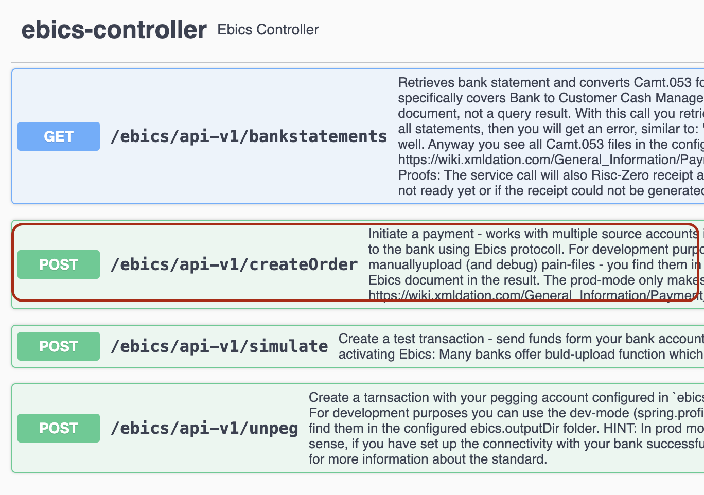
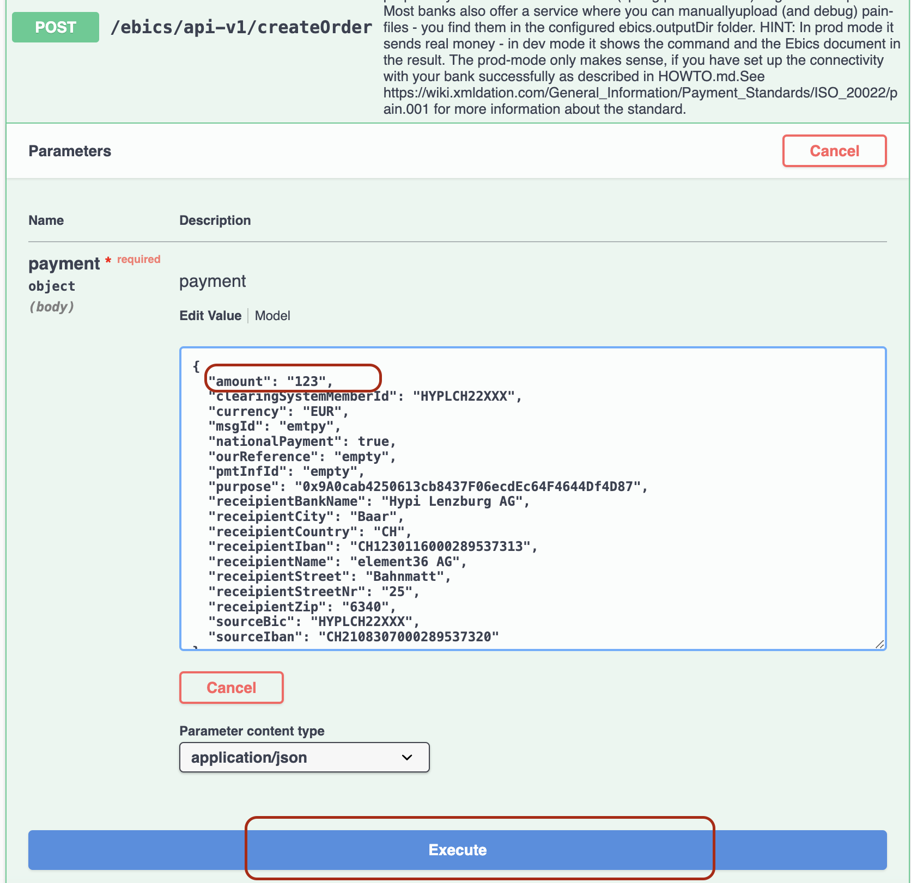
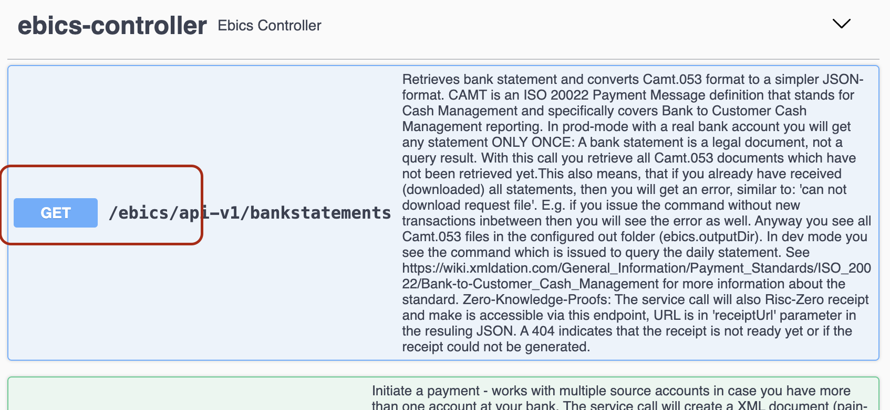
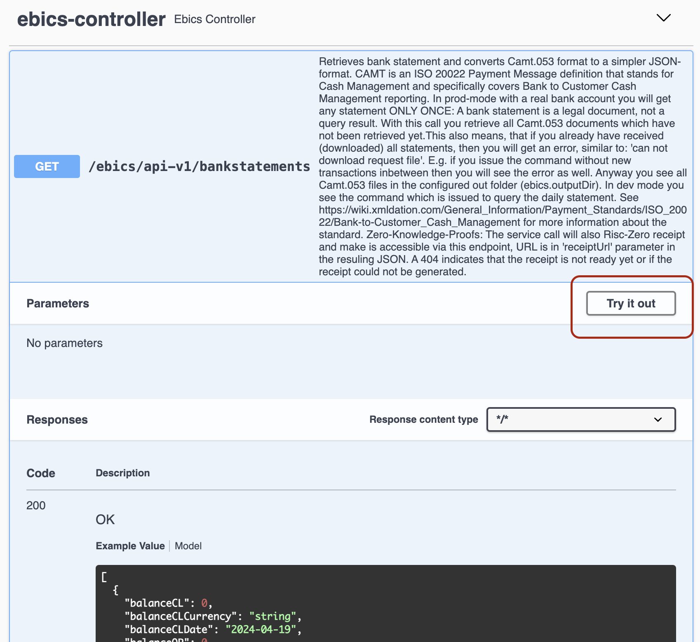
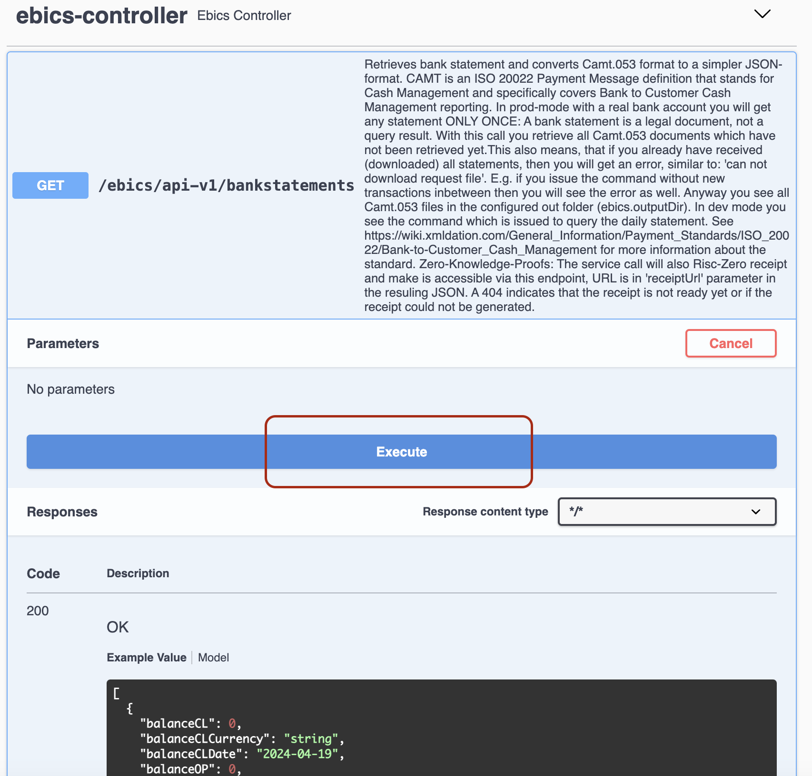
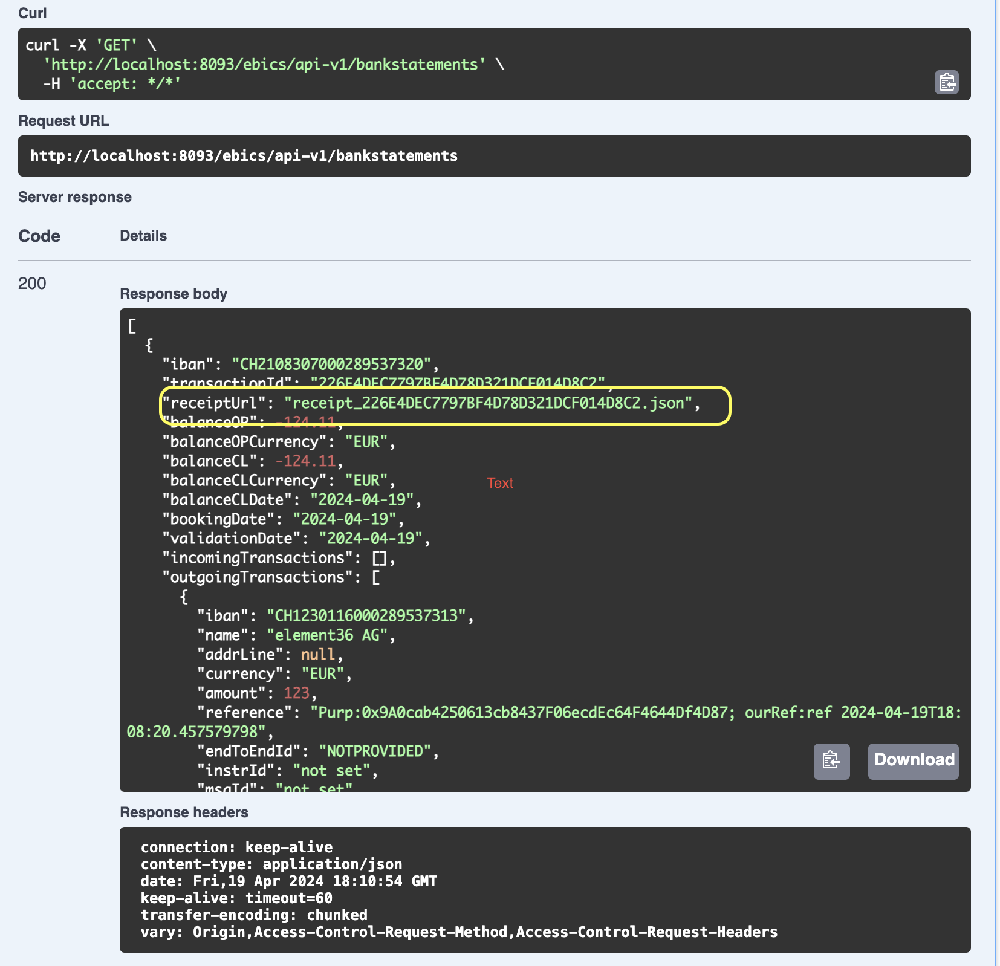

# UI Tests

Use OpenAPI/Swagger to crate a payment and doenload the Proof: [http://localhost:8093/ebics/swagger-ui/?url=/ebics/v2/api-do](http://localhost:8093/ebics/swagger-ui/?url=/ebics/v2/api-docs/)

User: 
## Create a payment

Hit Execute. 

## Generate Dailay Statement 

Note the receiptUrl for later download: 

## Download the proof

Replace XYZ with the value of recieptUrl to download the proof:  
http://localhost:8093/ebics/receipt_XYZ.json
