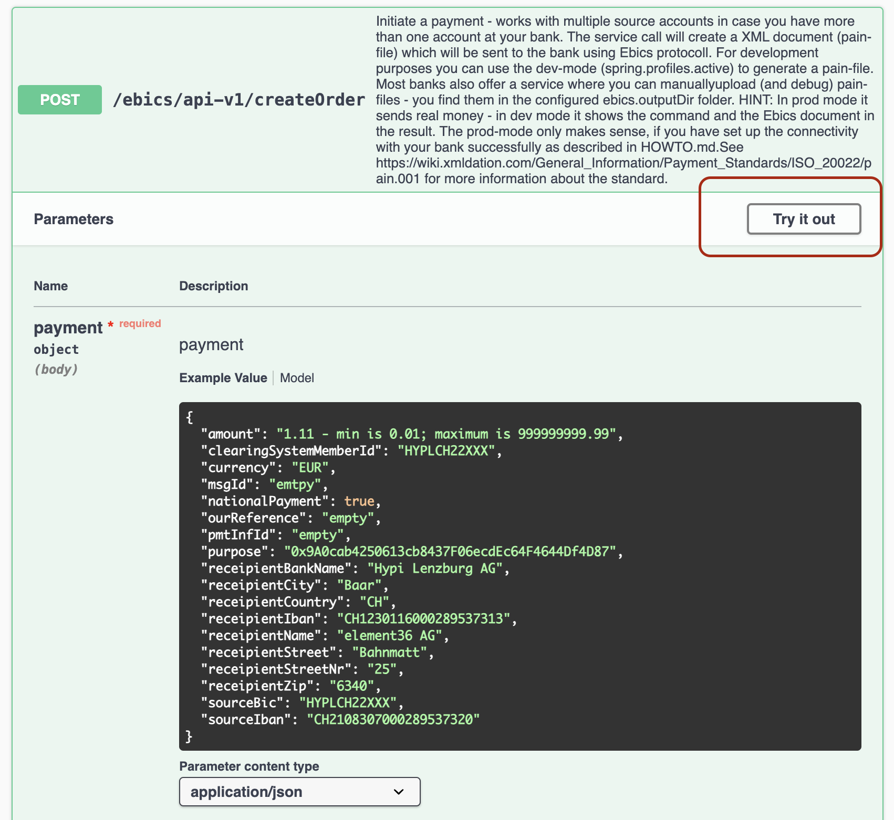

# UI Tests

Use Swagger for API call: 

## Create a payment

Hit Execute. 

## Generate Dailay Statement 

Note the receiptUrl for later download: 

## Download the proof

Add the value of recieptUrl to 'http://localhost:8093/ebics/':

http://localhost:8093/ebics/receipt_XXXXXXXXXXXX.json
